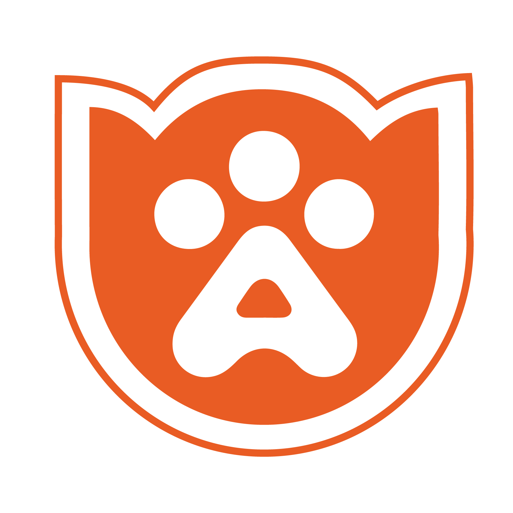

## 🐾 Animals.Id — Where Pet Care Meets Innovation 

[](https://animals-id.vercel.app)

[](https://github.com/YourGitHubUsername/Animals.Id/issues)
[](https://github.com/YourGitHubUsername/Animals.Id/stargazers)



Animals.Id is a comprehensive **pet services and e-commerce platform** designed to improve pet care through **innovative technology** and **expert veterinary knowledge**. From grooming to adoption, from pet training to product shopping, Animals.Id connects pet owners with the services and products they need—all in one place.

---

## 🚀 Features

### 🐶 Pet Services

* **Professional Grooming**: Breed-specific styling, premium products, dental care
* **Pet Training**: Obedience classes, behavior modification, one-on-one sessions
* **Veterinary Services**: Wellness exams, vaccines, nutritional advice
* **Pet Adoption**: Matchmaking, counseling, medical history, adoption events
* **Pet Boarding**: 24/7 care, playtime, webcam monitoring

### 🛒 E-Commerce

* Shop by pet category (dogs, cats, birds, fish, etc.)
* Detailed product listings with ratings & descriptions
* User-friendly cart & checkout experience

### 🧑‍💻 User Experience

* 🎮 Interactive 3D pet models
* ⚡ Animated UI with Framer Motion
* 📱 Fully responsive on all devices
* 💬 Real-time chat support
* 📆 Instant booking confirmation

---

## 🧱 Tech Stack

### 🖥️ Frontend

<p>
  
  
  
  
  
</p>

### 🧩 UI Components

* Custom 3D pet models
* Interactive category selector
* Service cards with pricing tiers
* Animated FAQ accordions
* 3D effect team cards

---

## 🎨 Design System

**Custom Animal-Themed Colors**

| Color Token     | Meaning              |
| --------------- | -------------------- |
| `animal-blue`   | Trust & Reliability  |
| `animal-green`  | Growth & Nature      |
| `animal-coral`  | Warmth & Energy      |
| `animal-yellow` | Happiness & Optimism |
| `animal-purple` | Luxury & Quality     |

---

## 🧩 Project Structure

```
animals-id/
├── public/           # Static assets (logo, banner)
├── src/
│   ├── assets/       # Images & icons
│   ├── components/   # Reusable UI components
│   ├── hooks/        # Custom React hooks
│   ├── pages/        # Route-level components
│   └── styles/       # Tailwind config and custom styles
├── package.json
└── README.md
```

---

## 👤 Team

| Name                  | Role               | Description                                                              |
| --------------------- | ------------------ | ------------------------------------------------------------------------ |
| **Chaerudin Saputra** | CEO                | Leading pet health innovations                                           |
| **Adrian Halim**      | Founder & CTO      | Tech innovator passionate about seamless digital experiences             |
| **Kirana**            | COO                | Former pet shop owner with deep knowledge of pet needs and customer care |

---

## 🛠 Getting Started

### 📦 Prerequisites

* Node.js `v14` or higher
* npm or yarn

### 🔧 Installation

```bash
# Clone the repository
git clone https://github.com/YourGitHubUsername/Animals.Id.git
cd Animals.Id

# Install dependencies
npm install

# Run the dev server
npm run dev
```

Visit **[http://localhost:5173](http://localhost:5173)** in your browser.

---

## 📜 License

[MIT](LICENSE) — feel free to use, modify, or share with attribution.

---

## 📬 Contact

For questions or partnership opportunities:
📧 \[[yourname@example.com](mailto:yourname@example.com)]
🌐 [www.animals.id](https://www.animals.id) *(if live)*

---

> **Animals.Id** — Helping pets live happier, healthier lives 🐾

---

Would you like a **live deploy badge**, **CI badge**, or **contribution guidelines** section added?
